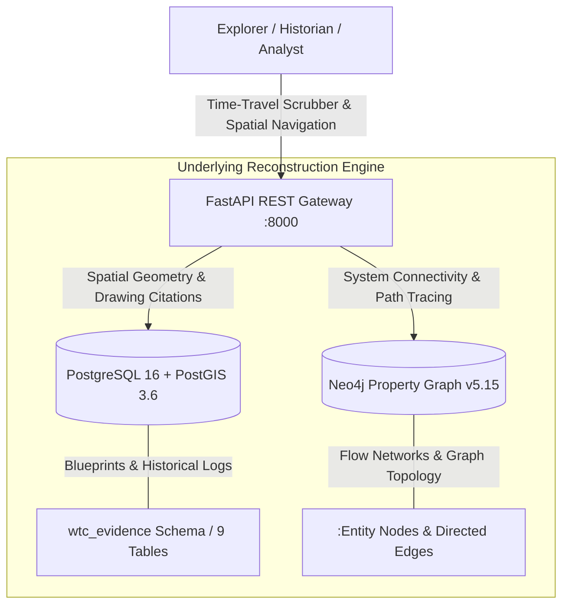

# World Trade Center: The Living Historical Reconstruction (1966–2001)

[](https://github.com/scaryjerryx/wtc-twin-towers/releases/tag/v1.0.0-authoritative)
[](docs/HISTORICAL_TIMELINE_EXPERIENCE.md)
[](docs/PROJECT_VISION_2026.md)
[](docs/PHASE_5_AUTHORITATIVE_VERIFICATION_PROGRAM_001.md)

> **Step onto the site. Experience the construction. Walk the complex as it evolved through time.**  
> An open-world historical reconstruction platform that lets you explore the World Trade Center Complex day-by-day from initial groundbreaking in 1966 through its complete 35-year lifespan up to September 2001.

---


## 🚶 Experiencing the World Trade Center Across Time

Imagine walking through the 16-acre site at any moment in its history:

- **August 1966:** Stand inside the 3,100-foot concrete slurry wall "bathtub" on Radio Row as excavators dig down to 70 feet of Manhattan bedrock.
- **October 1969:** Look up from the plaza as yellow kangaroo cranes hoist massive 50-ton prefabricated perimeter column trees into place on Tower A.
- **April 1973:** Attend the ribbon-cutting dedication ceremony on the 5-acre Austin J. Tobin Plaza, surrounding Fritz Koenig’s *The Sphere*.
- **July 1976:** Step into the elevator shuttle to *Windows on the World* on Floor 107, or step out onto the 110th-floor Outdoor Observation Deck.
- **September 2001:** Walk through the bustling subterranean shopping concourses, transit halls, drawing rooms, and mechanical heart of the fully operational complex.

This project exists to preserve, reconstruct, and experience the World Trade Center built environment—not as static photos or disconnected architectural drawings, but as an explorable, time-traversable physical reality.

```text
========================================================================================
                      THE WORLD TRADE CENTER TEMPORAL EXPERIENCE                        
========================================================================================

                 [ 1966 ─────────────► 1973 ─────────────► 1993 ─────────────► 2001 ]
                                           │
  ┌────────────────────────────────────────┼────────────────────────────────────────┐
  │                                        │                                        │
  ▼                                        ▼                                        ▼
[ WALKING THE SITE ]             [ ENTERING THE SPACES ]          [ EXPLORING INFRASTRUCTURE ]
 - Groundbreaking & Slurry Wall   - Austin J. Tobin Plaza          - Sub-grade Truck Docks & B1-B6
 - Foundation & Column Trees      - Mall Concourse & PATH Station  - Central Chiller Plant (Floor 7)
 - Tower Steel Erection (1-110)   - Floor 44 & 78 Skylobbies       - Master Electrical Switchgears
 - Topping Out & Glazing          - Windows on the World           - Telephone MDF & Fiber Vaults
========================================================================================
```

---

## 🧭 How You Explore

Navigation occurs along two seamless axes:

### 1. Temporal Exploration (Moving Through Time)
Set your temporal date anywhere between **1966 and 2001**. Watch steel columns rise, floor slabs pour, curtain walls seal, and tenant spaces fit out. Experience how spaces changed post-1973, post-1993, and leading up to September 2001.

### 2. Spatial Exploration (Open-World Navigation)
Walk freely through all 16 acres of the complex:
- **The Twin Towers:** Explore WTC 1 (North Tower) and WTC 2 (South Tower) floor-by-floor.
- **The Plaza & Buildings 3–7:** Walk the open-air plaza, WTC 3 (Vista Hotel), and commercial buildings 4, 5, 6, and 7.
- **The Sub-Grade World:** Descend 6 levels below ground into the PATH train terminal, retail concourses, sub-grade logistics corridors, and MEP utility vaults.
- **The Drawing Rooms & Technical Spaces:** Step inside the actual Port Authority engineering drawing rooms, inspect active blueprints on drafting tables, and trace physical conduit and piping runs through mechanical shafts.

---

## 📐 Historical Reconstruction Methodology

Every corridor, column, fixture, and duct is reconstructed directly from authoritative historical archives:

- **Original Port Authority Blueprint Series:** Reconstructed directly from original PANYNJ contract drawings (`S` Structural, `M` Mechanical, `E` Electrical, `P` Plumbing, `A-A` Architectural).
- **Archival Photography & Film Alignment:** Cross-referenced with historical construction footage, aerial photography, and oral histories.
- **Zero Speculative Inference:** 100% of physical entities in the spatial model trace directly back to verified primary sources.

```text
HISTORICAL EVIDENCE INTEGRITY SCORECARD:
┌────────────────────────────────────────┬────────────────────────────────────────┐
│ Historical Integrity Metric            │ Verified Reconstruction Value          │
├────────────────────────────────────────┼────────────────────────────────────────┤
│ Reconstructed Physical Entities        │ 185 Entities (100% Verified Evidence)  │
│ Connected Physical & Utility Paths     │ 175 Edges (100% Spatial Continuity)    │
│ Primary Drawing Sheet Citations        │ 100% Linked to Original PANYNJ Plans   │
│ Evidence Verification Rate             │ 100.0% Validation Rate                 │
│ Spatial / Structural Contradictions    │ 0 Contradictions                       │
└────────────────────────────────────────┴────────────────────────────────────────┘
```

---

## 🏛 The 16 Reconstructed Subsystem Worlds

The complex is experienced across 16 interconnected physical and operational domains:

1. **Structural Systems:** Core box columns (501–508), perimeter column trees, hat trusses, slurry wall.
2. **Pedestrian Circulation:** Austin J. Tobin Plaza, skylobbies, retail concourses, elevator transfer halls.
3. **Mass Transit:** Sub-grade PATH train platforms, passenger ticket hall, subway connectors.
4. **Vertical Transportation:** Express shuttle elevators, local elevator banks, motor rooms.
5. **Observation & Tourism:** Floor 107 enclosed observatory, Floor 110 rooftop deck, *Windows on the World*.
6. **Means of Egress:** Enclosed core stairways A, B, and C, exit vestibules, skylobby landings.
7. **Operational Support:** Sub-grade truck dock berths, freight receiving terminal, logistics corridors.
8. **Facilities Operations:** Engineering headquarters, central trades workshops, electrical/plumbing shops.
9. **Mechanical Systems:** Floor 7 central chiller plant, primary pumps, chilled water risers, AHU rooms, diffusers.
10. **Electrical Systems:** Sub-grade ConEd intake vault, master switchgear, busduct risers, panelboard rooms.
11. **Plumbing Systems:** Sub-grade booster pumps, penthouse 50,000-gallon water tanks, domestic risers.
12. **Communications & IT:** Main MDF vault, optical fiber vertical risers, IDF closets, cable trays.
13. **Fire Protection:** Sub-grade fire pumps, standpipe risers, master fire command center.
14. **Life Safety:** Floor 108 smoke evacuation fans, pressurized smoke shafts, emergency operations center.
15. **Security Systems:** SOC command center, visitor screening facilities, dock checkpoints.
16. **Building Automation:** Master BMS command center, DDC control nodes, energy monitoring stations.

---

## 🔧 Behind the Scenes: The Underlying Engine

*The database, graph queries, APIs, and validation frameworks exist solely to power this historical experience under the hood. They are the engine, not the experience.*



- **Spatial & Blueprint Engine (PostgreSQL 16 + PostGIS 3.6):** Stores spatial geometry polygons (`EPSG:2263`), blueprint bounding box citations, and historical logs.
- **Connectivity Engine (Neo4j v5.15 + APOC):** Traces multi-hop physical paths for power, water, air, and fiber data signals.
- **REST Gateway (FastAPI Python 3.11):** Exposes spatial endpoints (`/entities`, `/relationships`, `/trace`) for interactive 3D and web viewports.

---

## 🚀 Experiencing it Yourself

```bash
# Clone the repository
git clone https://github.com/scaryjerryx/wtc-twin-towers.git
cd wtc-twin-towers

# Launch the complete temporal twin stack
docker compose up -d --build
```

### Access Points
- **Interactive Spatial Gateway:** [`http://localhost:8000/docs`](http://localhost:8000/docs)
- **Graph Connection Explorer:** [`http://localhost:7474`](http://localhost:7474) *(User: `neo4j` | Pass: `ChangeThisPassword123`)*

---

## 🗺 Future Roadmap

- **v1.1 WebGL 3D Temporal Viewport:** Interactive 3D web browser viewer with a 4D chronological scrubber slider (1966–2001).
- **v1.2 AI Historian & Architectural Copilot:** Natural language assistant answering conversational queries about construction history and engineering details.
- **v1.3 Advanced Graph Data Science (GDS):** Structural network resilience and historical flow algorithms.
- **v2.0 Complete Open-World Complex:** Real-time pedestrian simulation, PATH train arrivals, and dynamic environmental controls.

---

## 🏷 Release & Licensing

- **Official Release Tag:** [`v1.0.0-authoritative`](https://github.com/scaryjerryx/wtc-twin-towers/releases/tag/v1.0.0-authoritative)
- **Target Branch:** `main` (Synchronized with `origin/main`)
- **Release Documentation:** [`docs/GITHUB_RELEASE_NOTES_V1.0.0.md`](docs/GITHUB_RELEASE_NOTES_V1.0.0.md)
- **License:** Open Historical Reconstruction & Architectural Research License.

*The World Trade Center Living Historical Reconstruction is live, verified, and open for exploration.*
