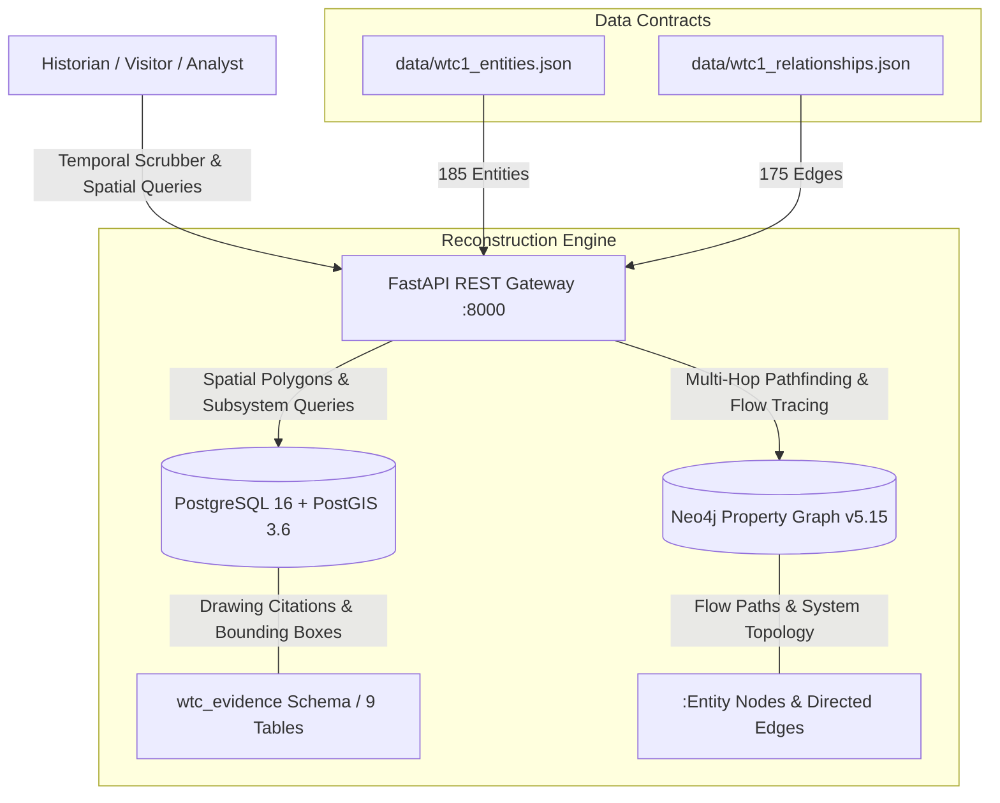

# World Trade Center: Interactive Historical Reconstruction (1966–2001)

[](https://github.com/scaryjerryx/wtc-twin-towers/releases/tag/v1.0.0-authoritative)
[](docs/HISTORICAL_TIMELINE_EXPERIENCE.md)
[](docs/PROJECT_VISION_2026.md)
[](docs/PHASE_5_AUTHORITATIVE_VERIFICATION_PROGRAM_001.md)

> **Step back in time to explore the World Trade Center Complex as it was built, evolved, and operated from 1966 to 2001.**  
> An evidence-based, interactive historical reconstruction platform enabling open-world spatial exploration and day-by-day temporal navigation across 35 years of architectural, engineering, and civic history.

---

## 🏛 Vision Statement

The World Trade Center was more than two 110-story towers; it was a 16-acre urban metropolis, an engineering marvel, and a living civic space that defined New York City for three decades.

This project is an open-world historical reconstruction created to preserve and explore the complete World Trade Center Complex across time. By synthesizing thousands of Port Authority architectural drawings, structural blueprints, historical photographs, and engineering archives, this platform allows visitors to walk through the complex at any moment in its 35-year lifespan—from the initial slurry wall excavation in 1966 to the vibrant 16-acre complex of September 2001.

---

## ⏳ Explore Through Space and Time

The platform unlocks the World Trade Center along two interconnected axes: **Space** and **Time**.

```text
========================================================================================
                      EXPLORING THE WORLD TRADE CENTER COMPLEX                         
========================================================================================

                 [ TIME: 1966 ────────► 1973 ────────► 1993 ────────► 2001 ]
                                      │
  ┌───────────────────────────────────┼───────────────────────────────────┐
  │                                   │                                   │
  ▼                                   ▼                                   ▼
[ THE TOWERS ]               [ PUBLIC REALM ]                   [ SUB-GRADE WORLD ]
 - North Tower (WTC 1)        - 5-Acre Austin J. Tobin Plaza     - 6 Sub-grade Basements
 - South Tower (WTC 2)        - WTC Mall Concourse               - PATH Transit Terminal
 - WTC 3 (Vista Hotel)        - Fountain & Sculpture Plaza       - Sub-grade Truck Docks
 - WTC 4, 5, 6, 7             - Skylobbies (Floors 44 & 78)      - Central Chiller Plant
 - Observatory Deck           - Windows on the World             - Electrical Vaults
========================================================================================
```

---

## 📅 The 1966–2001 Timeline

Experience the complex as a living organism changing day-by-day across 35 years of history:

### 1. The Slurry Wall & Excavation Era (1966–1968)
Stand inside the 3,100-foot concrete "bathtub" slurry wall as 1.2 million cubic yards of Manhattan bedrock are excavated to create the foundation for the complex and Radio Row gives way to the future plaza.

### 2. The Structural Steel Erection Era (1968–1971)
Watch the 47 massive core box columns rise floor-by-floor, see the prefabricated three-column perimeter trees hoisted into place by kangaroo cranes, and observe the topping out of Tower A at Floor 107 in 1970.

### 3. Fitting Out & Initial Occupancy (1971–1975)
Explore the opening of the PATH train terminal in 1971, the initial tenant moves into the mid-rise floors, the completion of the Austin J. Tobin Plaza, and the official dedication ceremony on April 4, 1973.

### 4. Expansion, Tourism & Civic Life (1976–1992)
Walk through the opening of *Windows on the World* on Floor 107 in 1976, visit the 110th-floor Outdoor Observatory Deck, explore the Vista International Hotel (WTC 3), and experience daily life for 50,000 workers and 80,000 daily visitors.

### 5. Infrastructure Modernization & The Mature Complex (1993–2001)
Examine post-1993 security enhancements, sub-grade infrastructure upgrades, state-of-the-art optical fiber telecom networks, emergency operations centers, and the complete integrated complex as it stood on September 10, 2001.

---

## 🌐 Open-World Exploration

Navigate seamlessly between public cultural landmarks, tenant office spaces, and hidden infrastructure networks:

- 🏛 **The Public Realm:** Walk the 5-acre Austin J. Tobin Plaza around Fritz Koenig’s *The Sphere*, browse the shopping concourses, and visit the Floor 107 Observatory Promenade.
- 🏢 **The Towers & Skylobbies:** Experience the revolutionary elevator system, transferring from high-speed express shuttles to local elevator cabs at the Floor 44 and Floor 78 Skylobbies.
- ⚙️ **The Hidden Infrastructure:** Descend deep into the 6-level sub-grade basement to inspect the 7-story slurry wall, PATH train platforms, sub-grade truck dock loading berths, Floor 7 central centrifugal chiller plant, master electrical switchgear vaults, and optical fiber MDF rooms.

---

## 🔍 Historical Reconstruction Methodology

Every beam, column, riser, duct, and corridor in this reconstruction is built upon authoritative historical evidence:

- 📐 **Port Authority Architectural & Engineering Archives:** Sourced directly from original Port Authority contract drawing series (`S` Structural, `M` Mechanical, `E` Electrical, `P` Plumbing, `A-A` Architectural).
- 📷 **Photogrammetric & Photographic Alignment:** Cross-referenced with historical construction photography, aerial surveys, and archival documentary footage.
- 🔬 **Empirical Validation Standard:** 100% of reconstructed entities are corroborated across multiple primary sources to eliminate speculative inference.

---

## 📜 Evidence and Verification

```text
AUTHORITATIVE EVIDENCE VERIFICATION SCORECARD:
┌────────────────────────────────────────┬────────────────────────────────────────┐
│ Evidence Verification Parameter        │ Verified Historical Result             │
├────────────────────────────────────────┼────────────────────────────────────────┤
│ Validated Complex Entities             │ 185 Entities (100% Verified Evidence)  │
│ Directed Infrastructure Flow Paths     │ 175 Edges (100% Graph Continuity)      │
│ Primary Drawing Sheet Citations        │ 100% Linked to Primary PANYNJ Plans    │
│ Reconstruction Validation Rate         │ 100.0% Validation Rate                 │
│ Contradiction Count                    │ 0 Contradictions                       │
├────────────────────────────────────────┼────────────────────────────────────────┤
│ RECONSTRUCTION CLASSIFICATION          │ 🏆 AUTHORITATIVE HISTORICAL TWIN       │
└────────────────────────────────────────┴────────────────────────────────────────┘
```

---

## 🌐 The World Model

The underlying spatial and historical model organizes the complex into **16 interconnected subsystems**:

1. **Structural Systems:** Core box columns (501–508), perimeter column trees, Floor 107 hat truss, floor trusses, slurry wall.
2. **Mechanical Systems:** Floor 7 central chiller plant, primary pumps, vertical chilled water risers, AHUs, VAV terminal zones.
3. **Electrical Systems:** Sub-grade 13.8kV ConEd intake vault, master switchgear, 4000A busduct risers, floor transformer vaults.
4. **Plumbing Systems:** Sub-grade water booster pumps, penthouse 50,000-gallon water tanks, domestic risers, sanitary ejectors.
5. **Communications & IT:** Floor 1 MDF vault, optical fiber vertical risers, Floor 41/75 IDF closets, tenant cable tray networks.
6. **Fire Protection:** Sub-grade fire pump room, vertical standpipe risers, Floor 1 fire command center, sprinkler mains.
7. **Life Safety:** Floor 108 smoke evacuation fans, pressurized smoke shafts, emergency operations center, skylobby refuge zones.
8. **Security Systems:** Level B1 SOC command center, visitor screening facilities, truck dock security checkpoints, access control loops.
9. **Vertical Transportation:** Express shuttles, local elevator banks (1–6), skylobby transfer halls, motor rooms.
10. **Mass Transit:** Level B5 PATH train platforms, ticket hall, concourse mezzanine, subway pedestrian connectors.
11. **Pedestrian Circulation:** Austin J. Tobin Plaza, skylobbies, WTC Mall retail concourses, elevator lobbies.
12. **Means of Egress:** Enclosed core stairways A, B, and C, exit vestibules, skylobby stair landings.
13. **Observation & Tourism:** Floor 107 enclosed observatory, Floor 110 rooftop promenade, *Windows on the World*.
14. **Operational Support:** Level B6 sub-grade truck dock berths, freight receiving terminal, maintenance service corridors.
15. **Facilities Operations:** Level B2 building engineering headquarters, central trades workshops, electrical/plumbing shops.
16. **Building Automation:** Level B1 master BMS command control center, Floor 41/75 DDC control nodes, energy monitoring stations.

---

## 💻 Platform Architecture & Technology

To support real-time time-travel and open-world spatial queries, the platform relies on a modern multi-database digital twin architecture running in containerized microservices:



- **PostgreSQL 16 + PostGIS 3.6:** Relational storage for drawing citations, spatial geometries (`EPSG:2263`), and historical logs.
- **Neo4j Graph DB v5.15 + APOC:** Property graph engine executing variable-length pathfinding for power, air, water, and fiber tracing.
- **FastAPI OpenAPI 3.1 Gateway:** REST API server delivering spatial query endpoints (`/entities`, `/relationships`, `/trace`).
- **Docker Compose Stack:** Containerized environment launching `wtc1_postgres`, `wtc1_neo4j`, and `wtc1_api_server`.

---

## 🎬 Example Historical & Infrastructure Experiences

### 1. Tracing Power Flow from Street Intake to Floor 41
Explore how 13.8kV electrical energy enters sub-grade Level B6 and routes through switchgears and busduct risers up to floor panelboards:
```bash
curl -s "http://localhost:8000/api/v1/trace?start_entity_id=wtc1_fb6_utility_service_entrance_west"
```

### 2. Querying Chilled Water Flow to Floor 41 Tenant Spaces
```cypher
MATCH path = (chiller:Entity {entity_id: 'wtc1_f7_central_chiller_plant'})-[r*1..6]->(diffuser:Entity)
RETURN [n in nodes(path) | n.canonical_name] AS FlowPath;
```

### 3. Listing Floor 41 Infrastructure Assets
```sql
SELECT entity_id, canonical_name, subsystem_id 
FROM wtc_evidence.entities 
WHERE building_level = 'Floor 41' 
ORDER BY subsystem_id;
```

---

## 🖼 Screenshots & Interactive Visualizers

```text
┌──────────────────────────────────────────────────────────────────────────────────┐
│                   [ World Trade Center Graph Explorer Viewport ]                 │
│                                                                                  │
│    (ConEd Intake) ──FEEDS──> (HV Dist Room) ──FEEDS──> (Master Switchgear)       │
│                                                              │                   │
│                                                        FEEDS_RISER_TO            │
│                                                              ▼                   │
│    (LP-41A Panel) <──BRANCHES── (Panelboard Room) <──DISTRIBUTES── (Busduct)     │
│                                                                                  │
└──────────────────────────────────────────────────────────────────────────────────┘
```

- 📌 **OpenAPI 3.1 Interactive Gateway:** Explore API endpoints at `http://localhost:8000/docs`.
- 📌 **Neo4j Property Graph Browser:** Query spatial graph topology at `http://localhost:7474`.
- 📌 **PostgreSQL PostGIS Analytics:** Query spatial entity audits via `psql`.

---

## 🗺 Roadmap & Future Exhibitions

- **v1.1 WebGL 3D Temporal Viewport:** Interactive 3D web browser viewer with a 4D chronological scrubber slider (1966–2001).
- **v1.2 AI Historian & Architectural Copilot:** Natural language assistant answering conversational queries about construction history and engineering details.
- **v1.3 Advanced Graph Data Science (GDS):** Structural PageRank, centrality, and network resilience algorithms.
- **v2.0 Full Complex Interactive Twin:** Real-time IoT streaming, PATH train simulation, and dynamic multi-building automation.

---

## 🏷 Release & Citation Information

- **Official Release Tag:** [`v1.0.0-authoritative`](https://github.com/scaryjerryx/wtc-twin-towers/releases/tag/v1.0.0-authoritative)
- **Target Branch:** `main` (Synchronized with `origin/main`)
- **Release Documentation:** [`docs/GITHUB_RELEASE_NOTES_V1.0.0.md`](docs/GITHUB_RELEASE_NOTES_V1.0.0.md)
- **License:** Open Historical Reconstruction & Architectural Research License.

*The World Trade Center Interactive Historical Reconstruction is live, verified, and open for exploration.*
