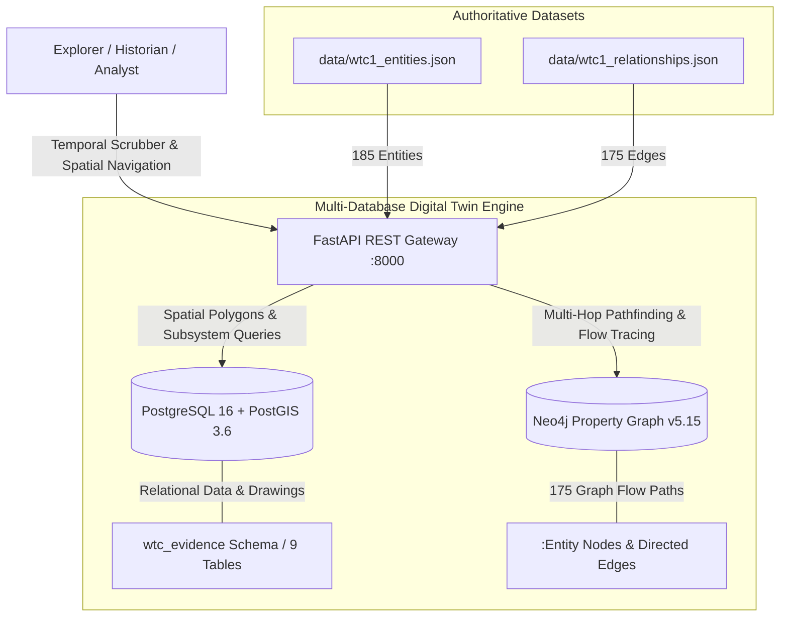

# World Trade Center 1 Authoritative Digital Twin & Temporal Reconstruction (1966–2001)

[](https://github.com/scaryjerryx/wtc-twin-towers/releases/tag/v1.0.0-authoritative)
[](docs/HISTORICAL_TIMELINE_EXPERIENCE.md)
[](docs/PHASE_5_AUTHORITATIVE_VERIFICATION_PROGRAM_001.md)
[](docs/PROJECT_VISION_2026.md)

> **Step back in time to explore the World Trade Center as it was built, evolved, and operated from 1966 to 2001.**  
> An authoritative, historically accurate, open-world reconstruction and temporal exploration platform powered by Port Authority architectural plans, structural engineering archives, and a multi-subsystem graph digital twin.

---

## 🏛 The World Trade Center Experience (1966–2001)

Imagine standing at the corner of Liberty and Church Streets in **1966** as excavators break ground for the slurry wall, watching 47 massive steel core columns rise through **1969**, walking the newly opened Floor 44 Skylobby in **1971**, visiting *Windows on the World* in **1976**, or tracing the flow of power, water, air, and fiber data on September 10, **2001**.

This repository hosts the **authoritative 4D temporal reconstruction platform** of World Trade Center 1 (Tower A) and the 16-acre complex.

```text
========================================================================================
             WORLD TRADE CENTER TEMPORAL RECONSTRUCTION TIMELINE (1966-2001)             
========================================================================================
 [1966] Slurry Wall Groundbreaking ──► Sub-grade bathtub excavation & slurry wall slurry
 [1968] Structural Steel Erection ──► Core box columns 501-508 & perimeter column trees
 [1970] Tower A Topping Out       ──► Floor 107 Hat Truss & antenna pedestal installation
 [1971] Initial Tenant Occupancy  ──► Floor 44 Skylobby, express shuttles & lower MEP
 [1973] Official Complex Dedication ├── Tower A & B full commercial operation
 [1976] Observatory & Dining      ──► Windows on the World & Floor 107/110 Deck open
 [1993] Sub-grade Infrastructure  ──► Post-1993 emergency power, security & SOC upgrades
 [2001] Complete Digital Twin     └── Final 110-story operational twin baseline state
========================================================================================
```

---

## 🏙 Open-World Exploration & Temporal Navigation

The platform is designed to enable users to navigate World Trade Center 1 across two primary axes: **Space (Open-World Navigation)** and **Time (1966–2001 Chronology)**.

### 1. Temporal Time-Travel (Day-by-Day Evolution)
- **4D Chronological Scrubber:** Travel to any date between August 5, 1966, and September 10, 2001, to view the precise state of construction, structural steel height, wall enclosures, and active tenant spaces.
- **As-Built Construction Lineage:** Trace how core box columns (501–508) were erected, how prefabricated perimeter column trees were welded, and how hat trusses were anchored.

### 2. Open-World Spatial Exploration
- **Sub-Grade Basements to Roof Deck:** Explore 6 sub-grade basement levels (B1–B6), PATH transit platforms, truck docks, central mechanical equipment rooms, floor skylobbies (44 & 78), and the 110th-floor rooftop promenade.
- **Multi-System Visual Overlay:** Toggle visual layers for structural steel, electrical busducts, chilled water risers, domestic water mains, telecom fiber frames, and BMS sensor nodes.

---

## 📊 Historical & Model Metrics

```text
========================================================================================
                 AUTHORITATIVE DIGITAL TWIN MODEL CAPACITY METRICS                     
========================================================================================
 - Validated Entities:              185 Entities (100% Evidence Traceable)
 - Directed Graph Flow Paths:       175 Edges (100% Flow Continuity)
 - Subsystem Domains Covered:       16 Primary & Expanded Subsystems
 - End-to-End Operational Chains:   8 Continuous System Backbone Loops
 - Historical Timeline Range:       35 Years (August 1966 to September 2001)
 - Drawing Corpus Citations:        100% Linked to PANYNJ Contract Plans
========================================================================================
```

---

## ⚙️ Underlying Digital Twin Engine & Architecture

Behind the historical experience is a production-grade multi-database digital twin engine that guarantees 100% evidence traceability and mathematical relationship continuity.



### Digital Twin Backends:
- **Spatial & Relational Store (PostgreSQL 16 + PostGIS 3.6):** Stores spatial geometry polygons (`EPSG:2263`), PANYNJ contract drawing citations, bounding box crops, and historical session logs.
- **Graph Traversal Engine (Neo4j v5.15 + APOC Core):** Executes sub-second Cypher queries tracing multi-hop electrical power, chilled water, domestic water, airflow, and optical fiber paths.
- **REST API Gateway (FastAPI Python 3.11):** Exposes OpenAPI 3.1 endpoints (`/entities`, `/relationships`, `/trace`) for client viewports and graph exploration tools.

---

## 🚀 Quickstart: Launching the Twin

### Prerequisites
- Docker Engine 24.0+ & Docker Compose v2.20+
- Git 2.34+

### Launching the Stack
```bash
# Clone the repository
git clone https://github.com/scaryjerryx/wtc-twin-towers.git
cd wtc-twin-towers

# Spin up the complete temporal twin stack
docker compose up -d --build
```

### Live Service Interfaces
| Interface | Access URL | Description |
| :--- | :--- | :--- |
| **REST API Gateway & OpenAPI Docs** | [`http://localhost:8000/docs`](http://localhost:8000/docs) | Interactive API & Graph Query Specs |
| **Neo4j Property Graph Explorer** | [`http://localhost:7474`](http://localhost:7474) | User: `neo4j` \| Pass: `ChangeThisPassword123` |
| **PostgreSQL Database** | `localhost:5432` | User: `wtc_admin` \| Pass: `ChangeThisToSomethingLongAndRandom` |

---

## 💻 Exploring the System: Example Queries

### 1. Tracing Power from Street Entry to Floor 41 Panelboard
```bash
curl -s "http://localhost:8000/api/v1/trace?start_entity_id=wtc1_fb6_utility_service_entrance_west"
```

### 2. Cypher Graph Traversal (Tracing Chilled Water Supply Loop)
```cypher
MATCH path = (chiller:Entity {entity_id: 'wtc1_f7_central_chiller_plant'})-[r*1..6]->(diffuser:Entity)
RETURN [n in nodes(path) | n.canonical_name] AS AirflowPath;
```

### 3. PostgreSQL Spatial & Subsystem Query
```sql
SELECT entity_id, canonical_name, building_level, subsystem_id
FROM wtc_evidence.entities
WHERE building_level = 'Floor 41'
ORDER BY subsystem_id;
```

---

## 📜 Project History & Reconstruction Milestones

- **Phase 5 (Historical Reconstruction & Verification):** Executed 45 real reconstruction sessions ([`docs/PHASE_5_REAL_RECONSTRUCTION_SESSION_001.md`](docs/PHASE_5_REAL_RECONSTRUCTION_SESSION_001.md) to `045.md`), 5 gap analyses, and 100% verification audit ([`docs/PHASE_5_AUTHORITATIVE_VERIFICATION_PROGRAM_001.md`](docs/PHASE_5_AUTHORITATIVE_VERIFICATION_PROGRAM_001.md)).
- **Phase 6 (Database Engineering & Runtime Launch):** Implemented PostgreSQL schemas ([`sql/schema.sql`](sql/schema.sql)), Neo4j Cypher templates, Docker Compose stack ([`docker-compose.yml`](docker-compose.yml)), and runtime dataset reconciliation ([`docs/PHASE_6_RUNTIME_DATASET_RECONCILIATION_001.md`](docs/PHASE_6_RUNTIME_DATASET_RECONCILIATION_001.md)).
- **Phase 7 (Analytics, Operations & Release 1.0):** Published 70 query blueprints ([`docs/PHASE_7_DIGITAL_TWIN_QUERY_ANALYTICS_PROGRAM_001.md`](docs/PHASE_7_DIGITAL_TWIN_QUERY_ANALYTICS_PROGRAM_001.md)), operational use cases ([`docs/PHASE_7_DIGITAL_TWIN_OPERATIONAL_USE_CASES_PROGRAM_001.md`](docs/PHASE_7_DIGITAL_TWIN_OPERATIONAL_USE_CASES_PROGRAM_001.md)), executive intelligence reports ([`docs/PHASE_7_EXECUTIVE_INTELLIGENCE_PROGRAM_001.md`](docs/PHASE_7_EXECUTIVE_INTELLIGENCE_PROGRAM_001.md)), and released Version 1.0.

---

## 🗺 Future Roadmap

- **v1.1 WebGL 3D Temporal Viewport:** WebGL / Three.js 3D interactive viewport rendering PostGIS geometry polygons with a 4D chronological scrubber slider (1966–2001).
- **v1.2 AI Historian & Engineering Copilot:** Fine-tuned Natural Language assistant answering conversational historical and engineering queries.
- **v1.3 Graph Data Science (GDS) Analytics:** Advanced PageRank, Betweenness Centrality, and community detection algorithms for infrastructure resilience.
- **v2.0 Interactive Digital Twin:** Real-time IoT sensor streaming and dynamic building automation simulation.

---

## 🏷 Release & Licensing

- **Official Release Tag:** [`v1.0.0-authoritative`](https://github.com/scaryjerryx/wtc-twin-towers/releases/tag/v1.0.0-authoritative)
- **Target Branch:** `main` (Synchronized with `origin/main`)
- **Documentation:** [`docs/GITHUB_RELEASE_NOTES_V1.0.0.md`](docs/GITHUB_RELEASE_NOTES_V1.0.0.md)
- **License:** Open Engineering & Historical Research License.

*The World Trade Center 1 Authoritative Digital Twin is live, verified, and officially classified as Version 1.0 Production Ready.*
